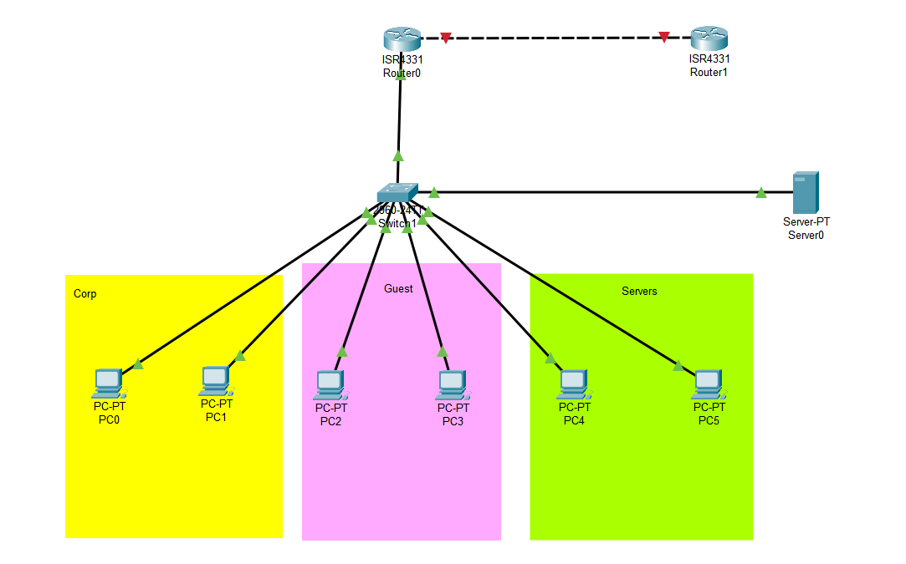

# Small Office / Home Office (SOHO) Network Lab

This project is a fully configured small office network built in Cisco Packet Tracer. It demonstrates a foundational understanding of core networking principles in routing, switching, and security. The goal was to create a segmented, secure, and scalable network for a small business with multiple departments.

## Network Topology

*A visual representation of the SOHO network, including VLANs, IP subnets, and device connections.*

```

```

## Key Features & Technologies Implemented

This lab demonstrates proficiency in the following areas:

### Switching
* **VLANs:** Segmented the network into three distinct broadcast domains: `CORP` (VLAN 10), `GUEST` (VLAN 20), and `SERVERS` (VLAN 30) for improved security and traffic management.
* **802.1Q Trunking:** Configured a trunk link between the switch and the router to carry traffic for all VLANs.
* **Port Assignment:** Statically assigned switch ports to their respective VLANs.

### Routing
* **Inter-VLAN Routing:** Implemented a "Router-on-a-Stick" configuration to enable communication between the CORP and SERVERS VLANs while keeping them logically separate.
* **Static Routing:** Configured a static default route on the Office Router to provide a path to the internet.

### Network Services
* **DHCP Server:** Configured the Office Router to act as a DHCP server, dynamically assigning IP addresses to hosts in the CORP and GUEST VLANs.
* **NAT/PAT:** Implemented Port Address Translation (PAT) on the edge router, allowing multiple internal devices with private IPs to access the internet using a single public IP.

### Security
* **Access Control Lists (ACLs):** (Future Addition) Standard and extended ACLs will be configured to filter traffic between VLANs, preventing the GUEST network from accessing internal resources.
* **Secure Management:** (Future Addition) SSH will be configured for secure remote management of network devices, and Telnet will be disabled.

## IP Addressing Plan

| VLAN ID & Name        | Network Address  | Subnet Mask     | Gateway Address  |
| --------------------- | ---------------- | --------------- | ---------------- |
| VLAN 10 (CORP)        | `192.168.10.0`   | `255.255.255.0` | `192.168.10.1`   |
| VLAN 20 (GUEST)       | `192.168.20.0`   | `255.255.255.0` | `192.168.20.1`   |
| VLAN 30 (SERVERS)     | `192.168.30.0`   | `255.255.255.0` | `192.168.30.1`   |
| WAN Link (Office-ISP) | `10.0.0.0`       | `255.255.255.252` | `10.0.0.1`       |

## Device Configurations

The final running configurations for each device can be found in the `configs/` directory of this repository.

* [`R0_Office-Router_config.txt`](configs/R0_Office-Router_config.txt)
* [`SW1_Switch_config.txt`](configs/SW1_Switch_config.txt)
* [`R1_ISP-Router_config.txt`](configs/R1_ISP-Router_config.txt)

## How to Use

1.  Download and install [Cisco Packet Tracer](https://www.netacad.com/courses/packet-tracer).
2.  Download the `SOHO-Network.pkt` file from this repository.
3.  Open the file in Packet Tracer to explore the topology, run simulations, and inspect device configurations.
